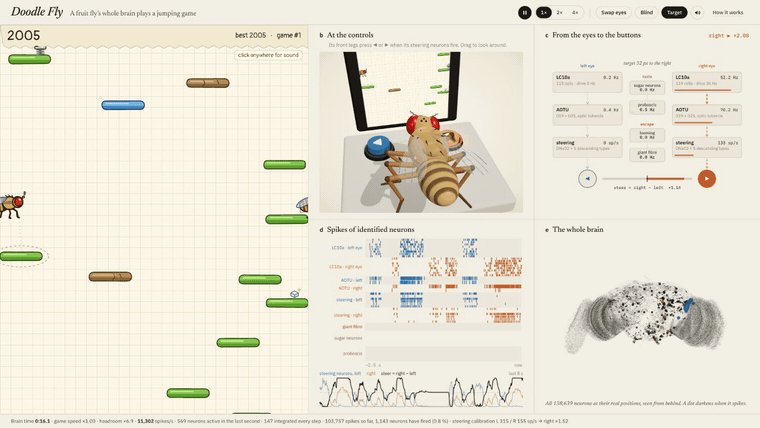
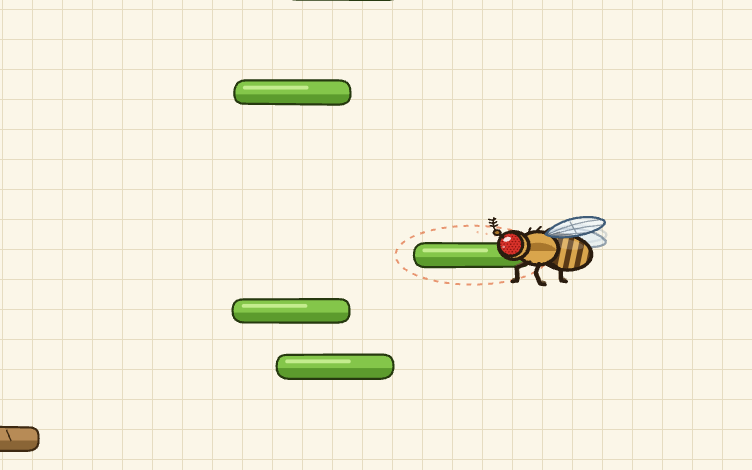
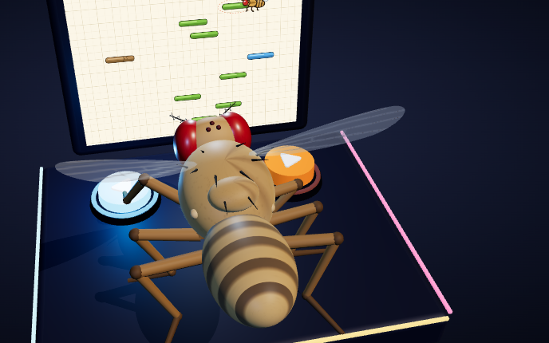
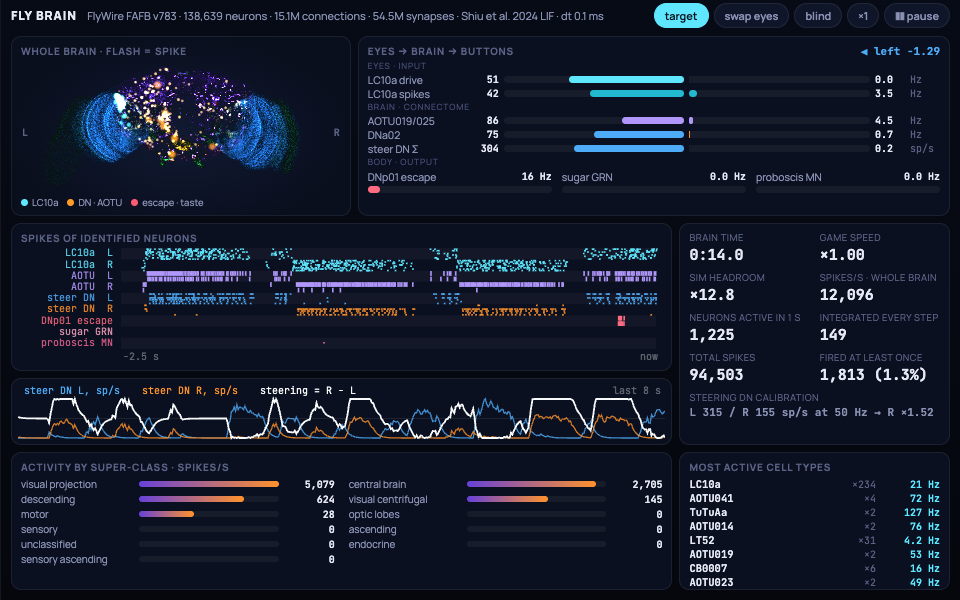
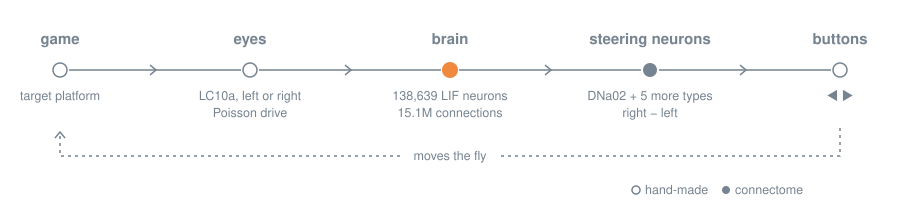

<div align="center">

# 🪰 Doodle Fly

**A fruit fly's entire brain plays a Doodle-Jump-style game — live, in your browser.**

138,639 spiking neurons · 15.1 million connections · zero training

### [▶ Play it in your browser](https://dtecx.github.io/doodle-fly/)

[](https://github.com/dtecx/doodle-fly/actions/workflows/pages.yml)




</div>

Scientists sliced a fruit fly's brain into 7,000 layers, imaged each one with an electron microscope and traced every
neuron and synapse. That wiring diagram — the [FlyWire](https://flywire.ai) connectome — is public.

Doodle Fly loads the whole thing into your browser, simulates every neuron spike by spike, shows it the game and reads
its moves out of the neurons that steer a real fly. Nobody taught it to play: the left/right decision comes out of the
wiring.

## What you're looking at

<table>
  <tr>
    <td width="33%"></td>
    <td width="33%"></td>
    <td width="33%"></td>
  </tr>
  <tr>
    <td valign="top"><b>The game.</b> A notebook-paper jumping game. The dashed ring is the platform the fly's eyes are
    locked on. Green platforms hold, blue ones move, brown ones crumble, white ones vanish. Springs launch, sugar cubes
    are a treat.</td>
    <td valign="top"><b>The fly.</b> A 3D <i>Drosophila</i> at an arcade cabinet. Its front legs press ◀ / ▶ when its
    steering neurons fire, the proboscis extends with its proboscis motor neurons, and it flinches when the giant fibre
    fires. Drag to orbit.</td>
    <td valign="top"><b>The brain.</b> Every neuron at its real position (flash = spike), the eyes → brain → buttons
    pipeline, a spike raster of identified neurons, the steering signal and the most active cell types right now.</td>
  </tr>
</table>

## How it works



1. **Eyes.** The game finds the highest platform the fly can still reach. Its horizontal offset becomes 14–80 Hz
   Poisson drive to the LC10a neurons on that side — small-object detectors, the cells a courting fly uses to chase a
   moving target. Straight ahead drives nothing.
2. **Brain.** All 138,639 neurons run as the leaky integrate-and-fire model of
   [Shiu et al., *Nature* 2024](https://www.nature.com/articles/s41586-024-07763-9) with its published parameters, at the
   paper's 0.1 ms time step. The signal travels through the anterior optic tubercle (AOTU019, AOTU025, …) into
   descending neurons, the brain's cables to the body.
3. **Buttons.** The steering command is the spike rate of six descending-neuron types on the right minus the left,
   including DNa02, a known steering neuron. They were picked once by stimulating LC10a in the model
   ([`scripts/survey.ts`](scripts/survey.ts)); a one-second calibration at start-up balances the two sides, because this
   brain's halves aren't mirror images. There is no trained readout.

Two more circuits are live: a **sugar cube** drives the sugar-sensing taste neurons, which drive the proboscis motor
neurons (the headline result of Shiu et al.), and **falling with nowhere to land** drives the looming detectors LPLC2 and
LC4, which drive the giant fibre DNp01 — the escape neuron.

## Is it really playing?

The same loop without graphics ([`scripts/play.ts`](scripts/play.ts)), 2 minutes of game time, five seeds per condition:

| condition | falls in 2 min | typical score | best of 5 |
|---|:---:|:---:|:---:|
| **intact brain** | **0–1** | **≈ 12,500** | **13,458** |
| eyes swapped (left eye → right LC10a) | 41–44 | 133 | 536 |
| blind (no drive to LC10a) | 0, hops in place | ≈ 280 | 297 |

Swap the eyes and the fly steers away from every platform; blind it and it hops on the spot. Both controls are buttons
in the app (**swap eyes**, **blind**), so you can check it yourself.

### What's real and what's engineered

| part | status |
|---|---|
| who connects to whom, synapse counts, excitatory / inhibitory | real FlyWire v783 data |
| neuron dynamics and parameters | Shiu et al. 2024, unchanged (v_th −45 mV, τ_m 20 ms, τ_s 5 ms, 0.275 mV per synapse, 1.8 ms delay) |
| left target → left descending neurons, right → right | emerges from the wiring |
| sugar → proboscis, looming → giant fibre | emerges from the wiring |
| which platform to aim for, target → LC10a drive, spikes → button press | hand-made interfaces |
| the 3D fly's pose | animation driven by the same signals, not biomechanics |

This is a toy: reconstructed wiring with approximate dynamics, not an uploaded fly. The brain is female and brain-only
(no ventral nerve cord), there's no learning, neuromodulation or gap junctions, and synapse strength is synapse count ×
a constant.

## The engine

The model is short to write down and big to run: 138,639 neurons × 10,000 steps per simulated second. What makes it
real-time in a Web Worker: between inputs, a leaky neuron follows a known closed-form curve, so a neuron is only stepped
while its state could still carry it over threshold (or while it is refractory or driven). Everyone else is updated
lazily, in O(1), when a spike reaches them.

That gives the same result as stepping every neuron (identical spike counts, group by group, in side-by-side runs) and
is ~25–30× faster: 2–60× real time on an Apple M4, depending on how many neurons are firing.

| piece | how |
|---|---|
| integration | exact solution of the linear system each step (like Brian2's `method='linear'`) |
| time step | 0.1 ms, as in the paper |
| data in the browser | 34 MB (gzip'd CSR, delta/varint encoded) |
| runaway guard | resets the state above 250k spikes/s (never triggered with the published parameters) |

## Run it locally

Needs Node ≥ 22.18 and, for the one-time data step, [uv](https://docs.astral.sh/uv/) (or Python ≥ 3.11 with numpy,
pandas and pyarrow).

```bash
git clone https://github.com/dtecx/doodle-fly
cd doodle-fly
npm install
npm run data   # download FlyWire v783 and pack it
npm run dev    # http://localhost:5173
```

`npm run data` downloads ~135 MB once (cached in `~/.cache/doodle-fly`) and writes 34 MB to `public/data/brain/`.
Click anywhere once to enable sound — browsers keep audio locked until you interact.

| key | action |
|---|---|
| `Space` | pause / resume |
| `F` | speed ×1 → ×2 → ×4 |
| `M` | sound on / off |
| `S` | swap eyes (control) |
| `B` | blind (control) |
| `T` | show / hide the target |

### From the terminal

```bash
npm run play -- --seconds 120   # headless game (add --swap or --blind)
npm run probe                   # stimulate LC10a, sugar, looming
npm run survey                  # which DNs follow LC10a left vs right
npm run readout                 # dose-response and latency of steering
npm run capture                 # screenshot + GIF (Chrome, ffmpeg)
```

## Deploy your own

[`.github/workflows/pages.yml`](.github/workflows/pages.yml) packs the connectome, builds the site and publishes it to
GitHub Pages on every push to `main`. On a fork, enable it once in **Settings → Pages → Source: GitHub Actions**.

## Project layout

```
scripts/build_data.py   download + pack FlyWire v783
src/brain/engine.ts     whole-brain LIF engine
src/brain/worker.ts     brain in a Web Worker + readout calibration
src/control.ts          target -> LC10a, steering DNs -> buttons
src/game/               game logic, paper renderer, hand-drawn fly
src/fly3d/              3D fly with IK legs, arcade cabinet
src/stats/              whole-brain spike map, statistics panel
src/audio.ts            synthesized sound effects
scripts/*.ts            headless experiments, screenshot capture
```

## Prior art

When the MaleCNS and FlyWire connectomes went public, people wired fly brains into
[everything](https://github.com/cobanov/awesome-fly). These projects shaped this one:

- [Aimbug](https://github.com/slickdomi/aimbug) showed that with Shiu's parameters, driving LC10a on one side drives
  DNa02 on the same side, and that LC10 carries the steering signal.
- [flybrain-snake](https://github.com/charbelkassab/flybrain-snake) steers Snake through LC10a → DNa01/DNa02 with zero
  training.
- [flydoom](https://github.com/mutkuoz/flydoom), on the same FlyWire brain, documents the left/right imbalance of DNa02
  (hence the calibration) and the sugar → proboscis response.
- [fly-flappy](https://github.com/ns2250225/fly-flappy), [Fly Dino](https://github.com/cobanov/flyjump) and
  [DOOMFLY](https://github.com/nftechie/doomfly): browser loading, honest labelling, learned vs wired controls.

## Credits & licenses

- **Connectome:** Dorkenwald, S. *et al.* Neuronal wiring diagram of an adult brain. *Nature* 634, 124–138 (2024);
  Schlegel, P. *et al.* Whole-brain annotation and multi-connectome cell typing of *Drosophila*. *Nature* 634, 139–152
  (2024). Cell types from [flyconnectome/flywire_annotations](https://github.com/flyconnectome/flywire_annotations).
  FlyWire data are released under [CC BY-NC 4.0](https://creativecommons.org/licenses/by-nc/4.0/): the data this project
  downloads and serves may be used with attribution, not commercially.
- **Brain model:** Shiu, P. K. *et al.* A *Drosophila* computational brain model reveals sensorimotor processing.
  *Nature* 634, 210–219 (2024); inputs from [philshiu/Drosophila_brain_model](https://github.com/philshiu/Drosophila_brain_model) (MIT).
- **DNa02 steering:** Rayshubskiy, A. *et al.* Neural circuit mechanisms for steering control in walking *Drosophila*.
  bioRxiv (2020).
- **Code:** [MIT](LICENSE), built with [Three.js](https://threejs.org) and [Vite](https://vitejs.dev).

Doodle Jump is a trademark of Lima Sky; this project is not affiliated with or endorsed by them. Every graphic and sound
here is original, drawn or synthesized in code.
