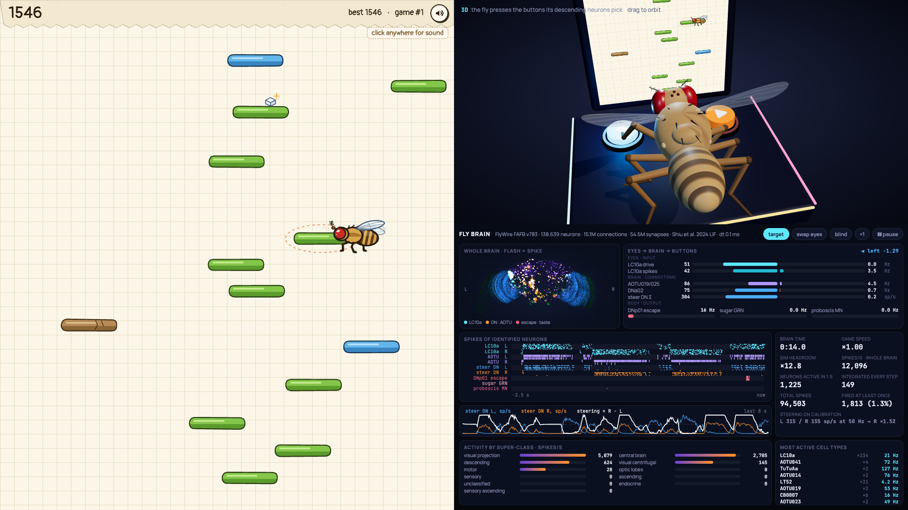
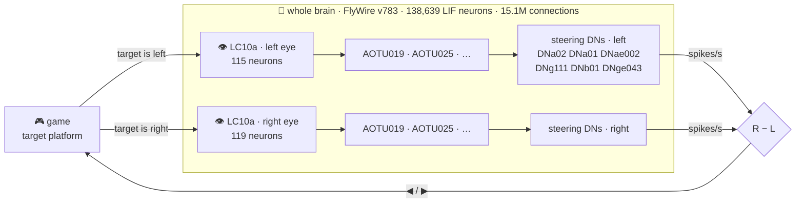

<div align="center">

# 🪰 Doodle Fly

### A fruit fly's *entire brain* plays a Doodle-Jump-style game — live, in your browser.

**138,639 spiking neurons · 15.1 million connections · zero training**


</div>

---

Scientists sliced a fruit fly's brain into 7,000 layers, imaged every layer with an electron microscope and traced
every neuron and every synapse. That wiring diagram — the [FlyWire](https://flywire.ai) connectome — is public.

**Doodle Fly loads the whole thing into your browser, simulates every neuron spike by spike, shows it the game and
reads its moves straight out of the neurons that steer a real fly.** Nobody taught it to play. The left/right decision
comes out of the wiring.

## What you're looking at



| | |
|---|---|
| **Left — the game** | A notebook-paper jumping game (original artwork, drawn in code). The dashed ring is the platform the fly's eyes are locked on. Green platforms are solid, blue ones move, brown ones crumble, white ones vanish; springs launch it, sugar cubes are a treat. |
| **Top right — the fly** | A procedural 3D *Drosophila* at an arcade cabinet. Its front legs press ◀ / ▶ exactly when its steering neurons fire, its proboscis extends when its proboscis motor neurons do, and it flinches when the giant fibre fires. The live game runs on the cabinet screen. Drag to orbit. |
| **Bottom right — the brain** | Every neuron at its real position (flash = spike), the *eyes → brain → buttons* pipeline with live rates, a spike raster of identified neurons, the steering signal, activity by super-class and the most active cell types right now. |

## How it works



1. **Eyes (hand-made interface).** The game finds the highest platform the fly can still reach. Its horizontal offset
   becomes 14–80 Hz Poisson drive to the **LC10a** neurons on that side — the fly's small-object detectors, the cells a
   courting fly uses to chase a moving target. Straight ahead drives nothing.
2. **Brain (the real thing).** All 138,639 neurons run as the leaky integrate-and-fire model of
   [Shiu et al., *Nature* 2024](https://www.nature.com/articles/s41586-024-07763-9) with its published parameters,
   at the paper's 0.1 ms time step, 167 steps per game frame. The signal climbs through the anterior optic tubercle
   (AOTU019, AOTU025, …) into descending neurons — the brain's cables to the body.
3. **Buttons (hand-made interface).** The steering command is the spike rate of six descending-neuron types on the
   right minus the left, including **DNa02**, a known steering neuron. They were picked once by stimulating LC10a in the
   model ([`scripts/survey.ts`](scripts/survey.ts)), and a one-second calibration at start-up balances the two sides
   (this brain's halves aren't mirror images). There is **no trained readout**.

Two side channels are also real circuits:

- 🍬 **Sugar cube → sugar-sensing taste neurons → proboscis motor neurons.** That's the headline result of Shiu et al.;
  watch the proboscis of both flies extend.
- 😱 **Falling with nowhere to land → looming detectors (LPLC2, LC4) → the giant fibre (DNp01)**, the escape neuron. The 3D
  fly flinches and flares its wings.

## Is the fly really playing?

Same game, same seeds, 2 minutes of game time each, five seeds per condition
([`scripts/play.ts`](scripts/play.ts) runs the identical loop without graphics):

| condition | falls in 2 min | typical score | best of 5 runs |
|---|:---:|:---:|:---:|
| 🪰 **intact brain** | **0–1** | **≈ 12,500** | **13,458** |
| 🔀 eyes swapped (left eye wired to right LC10a) | 41–44 | 133 | 536 |
| 🙈 blind (no drive to LC10a) | 0 — hops in place forever | ≈ 280 | 297 |

Swap the eyes and the fly steers *away* from every platform. Blind it and it just hops on the spot. Both controls are
one click away in the app (**swap eyes**, **blind**), so you can see it for yourself.

### What's real and what's engineered

| | |
|---|---|
| ✅ **Real data** | who connects to whom, how many synapses, excitatory or inhibitory (from the predicted transmitter) — FlyWire v783 |
| ✅ **Published model** | LIF dynamics and parameters of Shiu et al. 2024, unchanged (v_th −45 mV, τ_m 20 ms, τ_s 5 ms, 0.275 mV per synapse, 1.8 ms delay, 2.2 ms refractory) |
| ✅ **Emerges from wiring** | left target → left descending neurons, right → right; the sugar → proboscis response; looming → giant fibre |
| ⚙️ **Engineered** | *which* platform to aim for (the game plans the route), how a target becomes LC10a drive, how descending-neuron spikes become a button press |
| 🎨 **Cosmetic** | the 3D fly's pose. It shows the same left/right command, proboscis and giant-fibre signals, but it is animation, not biomechanics |

This is a toy: reconstructed wiring with approximate dynamics, not an uploaded fly. The brain is female and brain-only
(no ventral nerve cord), there's no learning, neuromodulation or gap junctions, and synapse strength is simply synapse
count × a constant.

## The engine

The model is small to write down and big to run: 138,639 neurons × 10,000 steps per simulated second. The trick that
makes it real-time in a Web Worker:

> Between inputs, a leaky neuron's membrane follows a known closed-form curve. So a neuron is only **stepped** while
> its current state could still carry it over threshold (plus while it is refractory or driven). Everyone else is
> updated **lazily**, in O(1), when a spike actually reaches them.

It gives the same result as stepping all 138k neurons (identical spike counts, group by group, in side-by-side runs)
and is ~25–30× faster: the full brain runs at 2–60× real time on an Apple M4, depending on how many neurons are
firing. The panel shows the live headroom.

| | |
|---|---|
| integration | exact solution of the linear system each step (like Brian2's `method='linear'`) |
| time step | 0.1 ms (as in the paper) |
| data in the browser | 34 MB (gzip'd CSR + delta/varint encoding of 15.1M connections) |
| runaway guard | resets the state if the whole brain ever exceeds 250k spikes/s (never triggered with the published parameters) |

## Run it

You need **Node ≥ 22.18** and, for the one-time data step, [**uv**](https://docs.astral.sh/uv/) (or any Python ≥ 3.11
with numpy, pandas and pyarrow).

```bash
git clone https://github.com/<you>/doodle-fly && cd doodle-fly
npm install
npm run data    # downloads FlyWire v783 (~135 MB, cached in ~/.cache/doodle-fly) and packs it (~34 MB)
npm run dev     # → http://localhost:5173
```

Click once anywhere to enable sound (browsers keep audio locked until you interact).

| key | |
|---|---|
| `Space` | pause / resume |
| `F` | speed ×1 → ×2 → ×4 |
| `M` | sound on / off |
| `S` | swap eyes (control) |
| `B` | blind (control) |
| `T` | show / hide the target |

### Poke the brain from the terminal

```bash
npm run play -- --seconds 120          # the brain plays headless; add --swap or --blind for the controls
npm run probe                          # stimulate LC10a, sugar, looming; print what responds
npm run survey                         # which descending neurons follow LC10a left vs right
npm run readout                        # dose-response, latency and left/right competition of the readout
npm run capture                        # docs/screenshot.png + docs/demo.gif (needs Chrome + ffmpeg; run `npm run dev` first)
```

## Deploy to GitHub Pages

The repo ships a workflow ([`.github/workflows/pages.yml`](.github/workflows/pages.yml)) that downloads and packs the
connectome, builds the site and publishes it. In **Settings → Pages**, set *Source* to **GitHub Actions** and push to
`main`; the game appears at `https://<you>.github.io/doodle-fly/`.

## Project layout

```
scripts/build_data.py    download + pack FlyWire v783 for the browser
src/brain/engine.ts      whole-brain LIF engine (lazy event-driven, exact)
src/brain/worker.ts      runs the brain in a Web Worker, calibrates the steering readout
src/control.ts           the two hand-made interfaces: target -> LC10a, steering DNs -> buttons
src/game/                game logic, notebook-paper renderer, hand-drawn fly
src/fly3d/               procedural 3D fly with IK legs, arcade cabinet
src/stats/               whole-brain spike map and the statistics panel
src/audio.ts             synthesized sound effects
scripts/*.ts             headless experiments and the screenshot/GIF capture
```

## Standing on the shoulders of flies

When MaleCNS and FlyWire went public, the internet wired fly brains into
[everything](https://github.com/cobanov/awesome-fly). A few projects taught us what to do from day one:

- [**Aimbug**](https://github.com/slickdomi/aimbug) showed that with Shiu's parameters, driving LC10a on one side
  drives DNa02 on the same side, and that LC10 — not the looming detectors — carries the steering signal.
- [**flybrain-snake**](https://github.com/charbelkassab/flybrain-snake) steers Snake with LC10a → DNa01/DNa02 and zero
  training, and is honest about what the wiring does on its own.
- [**flydoom**](https://github.com/mutkuoz/flydoom) (same FlyWire v783 brain) documents the standing left/right
  imbalance of DNa02 — the reason for our start-up calibration — and the sugar → proboscis response.
- [**fly-flappy**](https://github.com/ns2250225/fly-flappy), [**Fly Dino**](https://github.com/cobanov/flyjump) and
  [**DOOMFLY**](https://github.com/nftechie/doomfly) for browser loading, honest labelling and learned-vs-wired controls.

## Credits & licenses

- **Connectome:** FlyWire Consortium. Dorkenwald, S. *et al.* Neuronal wiring diagram of an adult brain.
  *Nature* 634, 124–138 (2024). Schlegel, P. *et al.* Whole-brain annotation and multi-connectome cell typing of
  *Drosophila*. *Nature* 634, 139–152 (2024). Cell-type annotations from
  [flyconnectome/flywire_annotations](https://github.com/flyconnectome/flywire_annotations). FlyWire data are released
  under [CC BY-NC 4.0](https://creativecommons.org/licenses/by-nc/4.0/): the packed data this project downloads or
  serves may be used with attribution and **not commercially**.
- **Brain model:** Shiu, P. K. *et al.* A *Drosophila* computational brain model reveals sensorimotor processing.
  *Nature* 634, 210–219 (2024) — model inputs from
  [philshiu/Drosophila_brain_model](https://github.com/philshiu/Drosophila_brain_model) (MIT).
- **DNa02 steering:** Rayshubskiy, A. *et al.* Neural circuit mechanisms for steering control in walking *Drosophila*.
  bioRxiv (2020).
- **Code:** [MIT](LICENSE). Built with [Three.js](https://threejs.org) and [Vite](https://vitejs.dev).
- Doodle Jump is a trademark of Lima Sky. This project is not affiliated with or endorsed by them; every graphic and
  sound here is original, drawn or synthesized in code.
